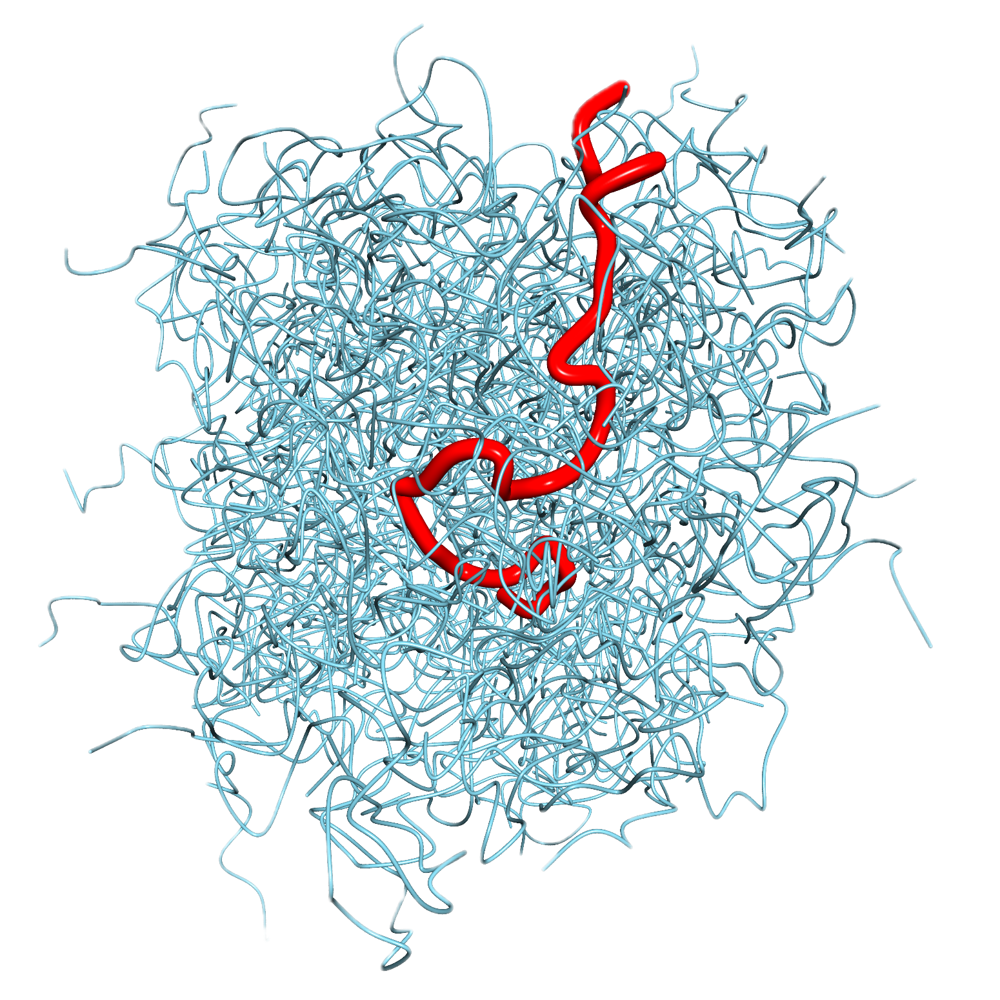

## ML-GLE: a machine learning enhanced Generalized Langevin Equation for Transient Anomalous Diffusion in Polymer Dynamics

#### NeurIPS 2023: Accepted at the Machine Learning and the Physical Sciences Workshop

!(https://github.com/Gian-Michele-Cherchi/ml-gle/assets/43932730/fc1f6bfb-ca91-464f-a038-afde3aaa9532)

### DATASET

The training dataset is available at at https://huggingface.co/datasets/gian-michele/meltBR
